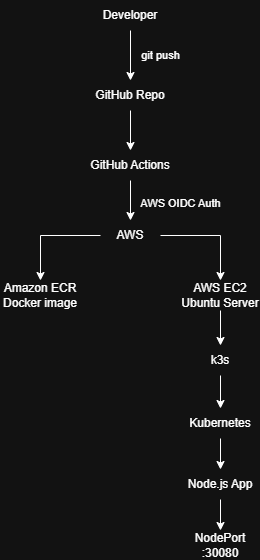

# DevOps Showcase - AWS, Kubernetes, Terraform and CI/CD

A containerized Node.js app deployed to Kubernetes on AWS EC2, with infra provisioned using Terraform and app delivery automated through GitHub Actions.

The app itself is intentionally simple. The main purpose of this project is to demonstrate practical DevOps concepts including cloud infra, containerization, K8s deployment, Infrastructure as Code, and CI/CD automation.

## Architecture



## Tech Stack

- App: Node.js, Express
- Containerization: Docker
- Cloud: AWS EC2, Amazon ECR, IAM
- Container orchestration: Kubernetes using k3s
- Infrastructure as Code: Terraform
- CI/CD: GitHub Actions
- Authentication: GitHub Actions OIDC with AWS IAM

## What This Project Demonstrates

### Infrastructure as Code

Terraform is used to provision AWS infrastructure, including:

- EC2 instance
- Amazon ECR repository
- Security group
- EC2 key pair
- IAM role and instance profile
- Required ECR permissions

The infra can be created or destroyed using Terraform instead of being configured manually through the AWS Console.

### Docker

The Express app is packaged into a Docker image using a Dockerfile. The image is then pushed to Amazon ECR, where it is used by the Kubernetes deployment.

### Kubernetes

The app is deployed to Kubernetes running on an EC2 instance through k3s.

The configuration includes:

- Deployment
- Service
- NodePort exposure
- Container port config

### CI/CD

GitHub Actions automates the app delivery process.

Automated steps:

1. `git push`
2. Checkout repo
3. Authenticate to AWS using OIDC
4. Login to Amazon ECR
5. Build Docker image
6. Push image to ECR
7. Connect to EC2 through SSH
8. Restart Kubernetes deployment
9. Verify rollout status

The workflow is triggered when changes are pushed to the `main` branch.

### AWS OIDC Auth

The GitHub Actions workflow uses AWS OIDC auth instead of storing long-lived AWS access keys inside GitHub Secrets.

This allows Actions to assume a specific IAM role for the repo and use temporary credentials during the workflow.

## Project Structure

```text
devops-showcase/
├── backend/              # Node.js application and Dockerfile
├── k8s/                  # Kubernetes Deployment and Service
├── terraform/            # AWS infrastructure configuration
├── .github/workflows/    # GitHub Actions CI/CD workflow
└── README.md
```

## Security Notes

This project is a learning and portfolio project.

The current infra config is intentionally simple and should not be treated as a production security baseline.

In a production environment, the following improvements would be appropriate:

- Restrict SSH access to trusted IP addresses
- Avoid exposing unnecessary ports publicly
- Use immutable image tags instead of relying on `latest`
- Use a more restricted IAM policy
- Store secrets in a dedicated secrets manager
- Add centralized logging and monitoring
- Use a managed Kubernetes service where appropriate

## Future Improvements

Possible future improvements include:

- Immutable Docker image tags based on Git commit SHAs
- Kubernetes resource requests and limits
- Detailed app health checks
- Centralized logging and monitoring
